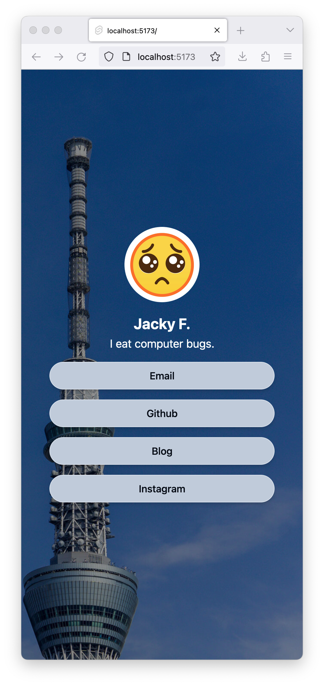

# Linky - a simple link in bio page

## Overview

This is a simple link in bio page that I created using SvelteKit. It is a simple page that allows you to add links to your social media profiles and other websites. It is a simple page that is easy to use and easy to customize.

### Features

- Add links to your social media profiles and other websites


### Screenshots

 
Main Page


## Tech

### Developing

Once you've clone this project and installed dependencies with `npm install` (or `pnpm install` or `yarn`), start a development server:

```bash
npm run dev

# or start the server and open the app in a new browser tab
npm run dev -- --open
```

### Building

To create a production version of your app:

```bash
npm run build
```

You can preview the production build with `npm run preview`.

> To deploy your app, you may need to install an [adapter](https://kit.svelte.dev/docs/adapters) for your target environment.


### Technologies

This project uses the following tech:

- [SvelteKit](https://kit.svelte.dev/) - The framework for building the app
- [Tailwind CSS](https://tailwindcss.com/) - A utility-first CSS framework
- [shadcn-svelte](https://www.shadcn-svelte.com/) - A component library for SvelteKit
- [SASS](https://sass-lang.com/) - A CSS extension language